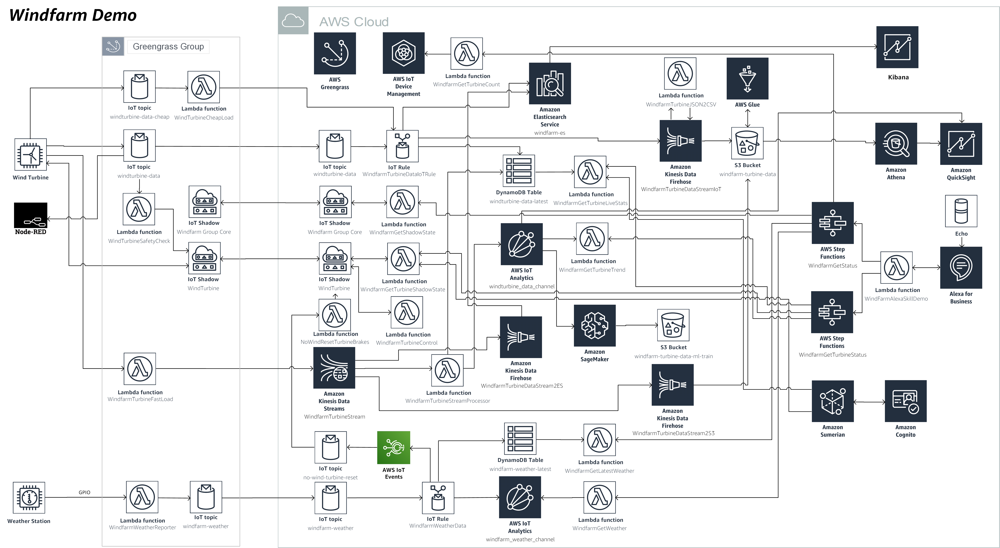

# Windfarm Demo Software

### Purpose:
This project is intended to demonstrate several features of AWS IoT and related services for practical use cases. It leverages a 3D printed wind turbine and weather station that documented seperately.

The demo hardware for these models are in a seperate repo [here](https://github.com/KevinOleniczak/Windfarm-hardware).

### What's included:
This demo windfarm contains several model elements that help you experience the interactions between a turbine and a monitoring station on the edge. Connectivity with the AWS Cloud is not required to observe a safety assessment that is performed with real data that published continually from the turbine.

### What does it do:
See how industrial edge connectivity is accomplished with AWS services. An IoT device read sensor values from a wind turbine continually and publish it to a local IoT Gateway using AWS Greengrass. The gateway receives the data and performs a local inference to evaluate turbine safety based on rotation speed and vibrations. Data is selectively shared with the AWS Cloud where it can be used to build and train machine learning models, stored for analytical purposes and visualized over time on a dashboard.

### How does it work:

High Level architecture

Detailed architecture

### TODO:
